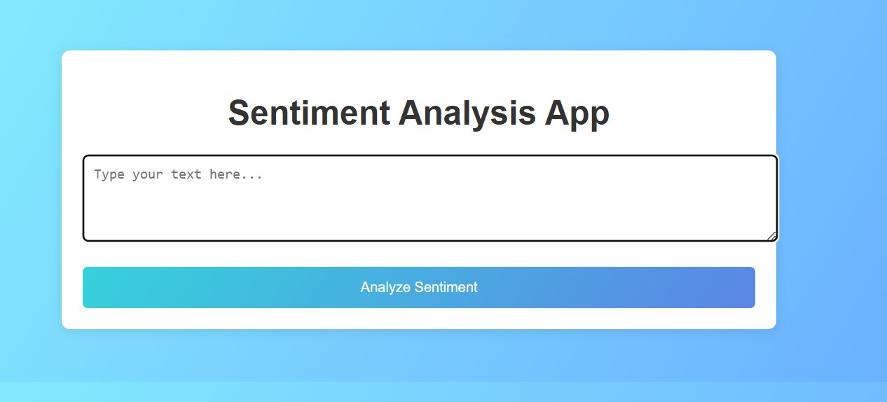

# Sentiment-Analysis-App-With-Python-Flask

This is my repository that contains the source code of my web app that performs sentiment analysis on given text using Python libraries.

You can check my application which is deployed [here](https://huggingface.co/spaces/SoorajAliPanhwar/Simple-Sentiment-Analysis-App) on huggingface.co

This application is written in Python language and Flask. You can copy the repo to your local repository and run the app by installing the requirements
```bash
pip install -r requirements.txt
```
from the `requirements.txt` file first, and then run the app using VS Code terminal with the following command:

```bash
python app.py
```

Then the vscdoe will give you the local hosting address here the html page is being hostel, copy it and paste it on the url input of your internet browser
The looks like the following screenshot:


